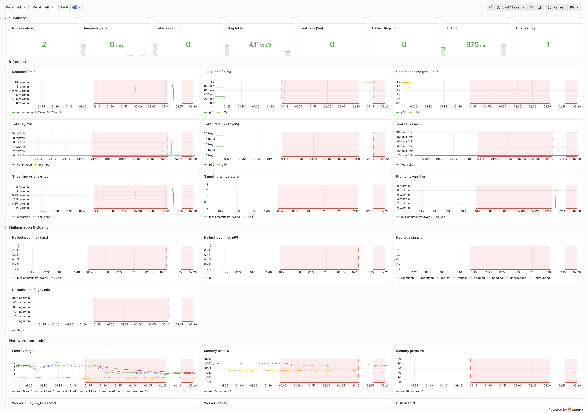
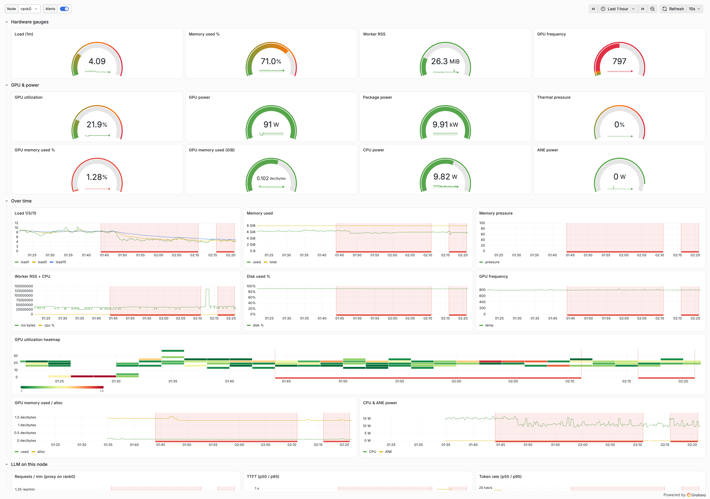
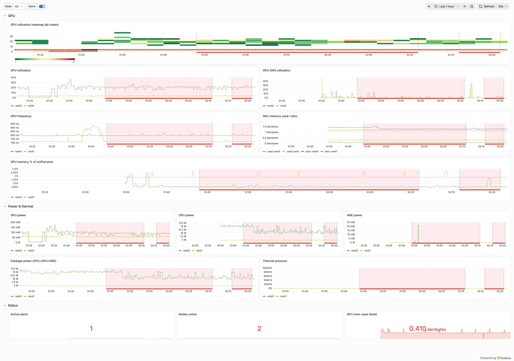
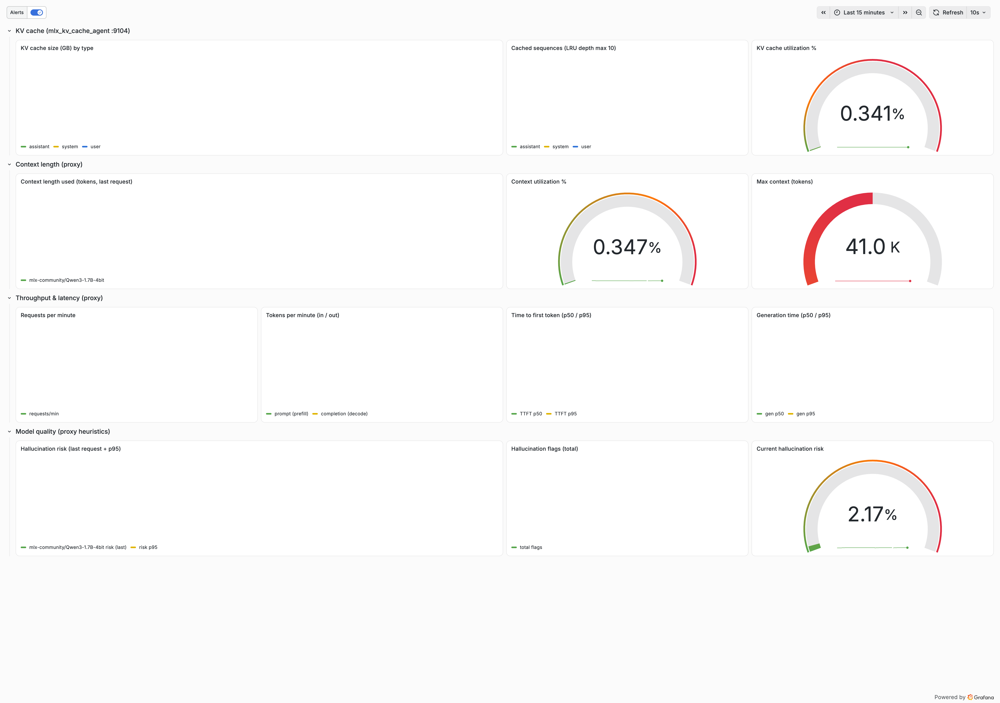
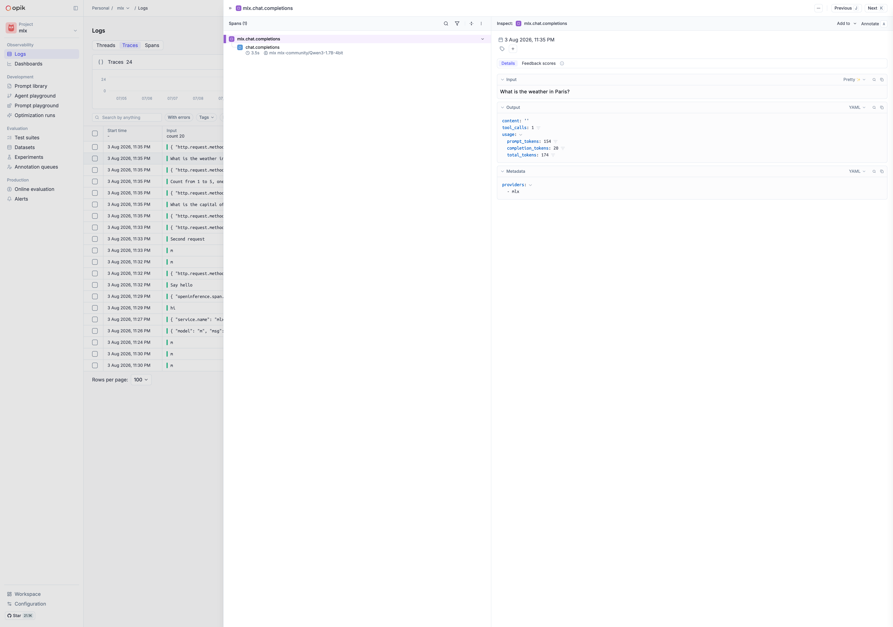
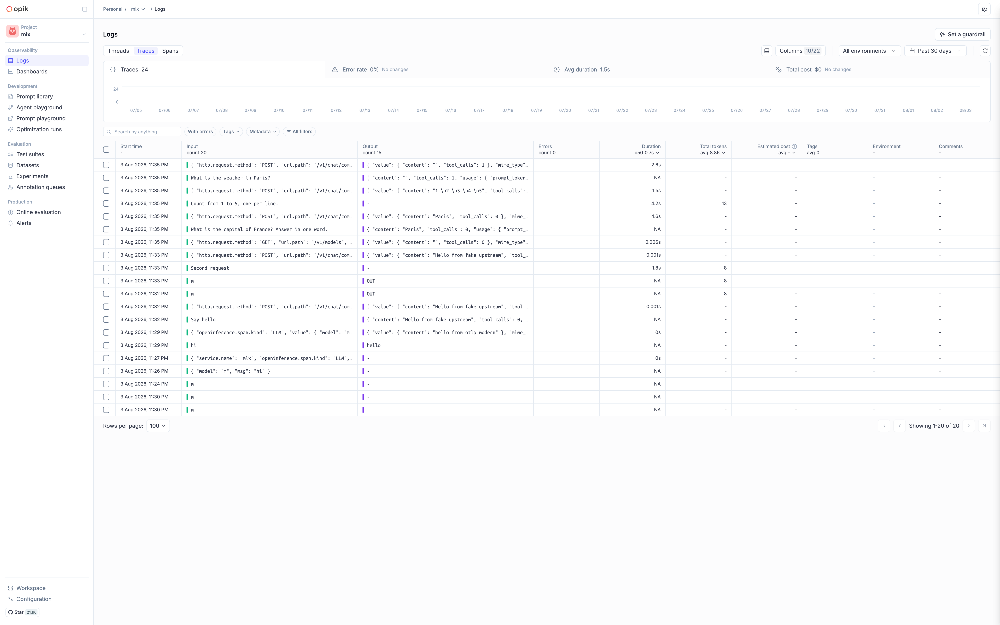
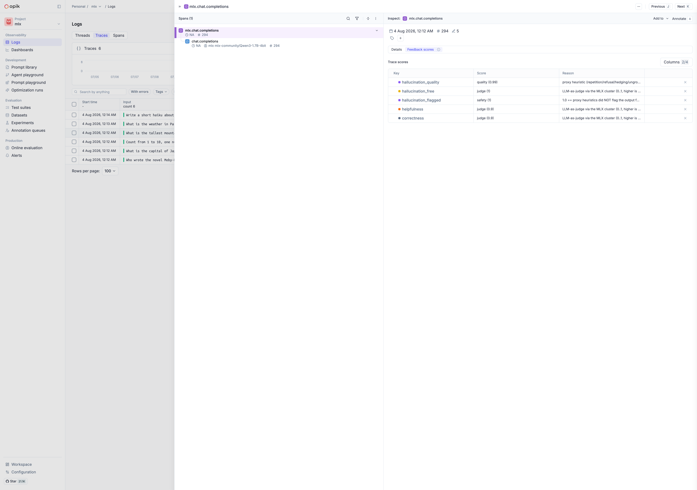
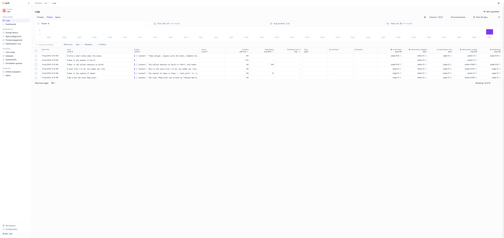

# mlx-oc

Distributed MLX LLM inference on a two-Mac-mini cluster, fronted by a
Prometheus/OpenTelemetry-observable proxy, with a full
VictoriaMetrics + Grafana observability stack running locally on podman.

```
clients (opencode / curl)
        │  OpenAI-compatible API
        ▼
mlx_metrics_proxy.py :8080 ──► mlx_lm.server :8081 (ring: rank0 + rank1)
        │   /metrics (Prometheus text)
        │   OTLP traces+logs ──► otel-collector ──► VictoriaMetrics
        │   opik SDK + OTLP (OpenInference) ──► Opik :32173 (self-hosted on k0s)
        ▼
mlx_hw_telemetry.py :9102  per-node CPU / RAM / disk / GPU / power (both nodes)
        │   scraped every 15s
        ▼
      VictoriaMetrics ──► vmalert :8880 (46 rules) ──► Alertmanager :9093
                      └──► Grafana :3000 (12 dashboards)
```

## Stack

| Piece | Where | Port | What it does |
|---|---|---|---|
| `mlx_lm.server` | both nodes (rank 0 + rank 1) | 127.0.0.1:8081 | distributed inference via the `ring` backend (`mlx.launch --backend ring`) |
| `cluster/mlx_metrics_proxy.py` | rank 0 | 0.0.0.0:8080 | OpenAI-compatible front door; records TTFT, token rate, temperature, tool calls, hallucination-risk heuristics |
| `cluster/mlx_hw_telemetry.py` | both nodes | 0.0.0.0:9102 | hardware telemetry (load, memory pressure, disk, worker CPU/RSS, CPU temp, GPU util/power, package power, thermal pressure) |
| `cluster/start_server.sh` / `stop_server.sh` | rank 0 | – | launch / tear down the whole stack |
| `observability/compose.yaml` | podman (rank 0) | 8428 / 4317 / 4318 / 3000 / 8880 / 9093 | VictoriaMetrics + otel-collector + Grafana + vmalert + Alertmanager |
| `sglang/start_server.sh` / `stop_server.sh` **(experimental, unverified device backend)** | both nodes, independent replicas | 0.0.0.0:30000 | scaffolding to launch two standalone SGLang servers (no ring/TP); Apple Silicon GPU support is unconfirmed |

Model: set once in `cluster/cluster.env` (`MLX_MODEL=...`) — every script under
`cluster/` and `tools/` reads it from there (via the `MLX_MODEL` env var), so
changing the model means editing that one file, not grepping the repo.

## Quick start

Air-gapped / offline install (wheelhouse + model transfer): see [INSTALL.md](INSTALL.md).

To change the model, edit `cluster/cluster.env` (`MLX_MODEL=...`), then
re-run `./render-config.sh` to regenerate `opencode.json` from it before
restarting the stack:

```bash
./render-config.sh               # regenerate opencode.json from cluster.env
./cluster/start_server.sh        # launches server (both nodes), proxy, hw agents
curl -s http://127.0.0.1:8080/v1/models
curl -s http://127.0.0.1:8080/metrics | head
curl -s http://127.0.0.1:9102/metrics | grep mlx_hw_load1
./cluster/stop_server.sh         # tears everything down
```

Any OpenAI-compatible client works against `http://<rank0-ip>:8080/v1` —
e.g. `opencode` pointed at `http://192.168.1.64:8080/v1/chat/completions`.

## Benchmarks

> **Snapshot, not current**: the numbers below were measured against
> `mlx-community/Qwen3-1.7B-4bit` specifically. The cluster's actual model
> (`cluster/cluster.env`, `MLX_MODEL`) has since changed — re-run
> `tools/bench.py` against whatever's configured now for current numbers
> rather than assuming these still hold.

Measured with `tools/bench.py` against `Qwen3-1.7B-4bit` (temp 0.0, 3 iters).
The 2-node ring is `~3×` slower than a single Mac for this tiny model — the
ring collectives dominate at 1.7B parameters. Distribution pays off only when
the model is too big for one node's memory.

| Metric | Single node | 2-node ring | Ratio |
|---|---|---|---|
| **TTFT (time to first token)** | <span style="color:#0f766e">~0.1–0.2s</span> | <span style="color:#b45309">~0.2s</span> | 1–2× |
| **Short prompt (~40 tokens out)** | <span style="color:#0f766e">0.8s · ~65 tok/s</span> | <span style="color:#b45309">2.4s · ~18 tok/s</span> | ~3× |
| **Medium prompt (~70 tokens out)** | <span style="color:#0f766e">2.0–3.4s · ~32 tok/s</span> | <span style="color:#b45309">6.9s · ~10 tok/s</span> | ~3× |
| **Long prompt (~90 tokens out)** | <span style="color:#0f766e">2.1–3.9s · ~44 tok/s</span> | <span style="color:#b45309">7.0s · ~12 tok/s</span> | ~3× |
| **256-token cap (medium/long)** | <span style="color:#0f766e">3.4–3.9s · ~36–44 tok/s</span> | <span style="color:#b45309">13.9–14s · ~11 tok/s</span> | ~3.5× |

**Concurrency burst** (4 clients, 12 requests total, `--max-tokens 256`):

| Configuration | Wall time | Mean per-request | Aggregate throughput |
|---|---|---|---|
| Single node | <span style="color:#0f766e">26.8s</span> | 8.9s | <span style="color:#0f766e">~51.5 tok/s</span> |
| 2-node ring | <span style="color:#b45309">61.6s</span> | 20.5s | <span style="color:#b45309">~23.6 tok/s</span> |

Run them yourself:

```bash
.venv/bin/python tools/bench.py --base http://127.0.0.1:8080/v1 \
  --model mlx-community/Qwen3-1.7B-4bit --iters 3 --label "2-node ring"

.venv/bin/python tools/bench.py --concurrency 4 --max-tokens 256 \
  --iters 5 --label "4-way burst"
```

## SGLang (experimental)

`sglang/` is scaffolding for a third engine in a planned three-way benchmark
(MLX ring vs. `vllm-metal` vs. SGLang) on the same two Mac minis. Nothing in
this folder has been run — it is orchestration/observability wiring only.

**Unverified device backend, stated plainly:** SGLang's primary backend is
CUDA (FlashInfer/Triton kernels on NVIDIA GPUs). There is no confirmed,
mainstream Metal/MLX backend for SGLang comparable to `vllm-metal`'s MLX
fork. `sglang/start_server.sh` leaves `SGLANG_DEVICE` unset by default and
warns loudly — confirm against SGLang's own docs before assuming Apple
Silicon GPU support works, or works well, at all.

**Architecture — independent replicas, not one distributed model:** unlike
`cluster/`'s MLX ring backend (`mlx.launch --backend ring`, one logical model
split across both nodes), SGLang has no ring/tensor-parallel backend for
Apple Silicon (no NCCL/CUDA available). So each node runs its own complete,
independent SGLang replica on `:30000`. Load balancing across the two
replicas (nginx round-robin) is documented, not scripted — reuse the pattern
already written up in `vllm-metal/index.html` (section 5, "Load balancing
and routing") instead of duplicating an nginx config here.

**No metrics proxy needed:** unlike `mlx_lm.server` (which needed
`cluster/mlx_metrics_proxy.py` as a sidecar because it has no metrics of its
own), SGLang emits native Prometheus metrics on its own `/metrics` under the
`sglang:*` namespace (e.g. `sglang:time_to_first_token_seconds_bucket`,
`sglang:num_running_reqs`, `sglang:num_waiting_reqs`, `sglang:token_usage`,
`sglang:cache_hit_rate`, `sglang:gen_throughput`). Hardware telemetry is
reused as-is from `cluster/mlx_hw_telemetry.py` (already running on both
nodes at `:9102` — it's engine-agnostic).

```bash
SGLANG_MODEL=<hf-model-id> ./sglang/start_server.sh   # launches both replicas
curl -s http://127.0.0.1:30000/health
curl -s http://127.0.0.1:30000/metrics | head
./sglang/stop_server.sh
```

## Metrics (Prometheus)

Proxy `/metrics` (`--metrics-path`):

* `mlx_requests_total{model,streaming}`
* `mlx_ttft_seconds` (histogram), `mlx_gen_seconds`, `mlx_token_rate_tokens_per_second`
* `mlx_tokens_prompt_total`, `mlx_tokens_completion_total`
* `mlx_temperature`, `mlx_tool_calls_total{model,kind,tool,type}` (tool = function name, type = OpenAI call type)
* `mlx_hallucination_risk{model}` gauge + `mlx_hallucination_risk_histogram_bucket`
* `mlx_finish_reason_total{model,reason}`
* `mlx_upstream_up`

Token confidence (from the sampler's logprobs, not from the text):

* `mlx_output_perplexity{model}` + `mlx_output_perplexity_histogram_bucket`
* `mlx_token_entropy_nats{model}` + `mlx_token_entropy_histogram_bucket`
* `mlx_token_confidence_mean{model}`, `..._min`, `..._std`
* `mlx_token_margin_mean{model}` — top-1 minus top-2 probability
* `mlx_low_confidence_token_ratio{model}`
* `mlx_confidence_scored_total{model,source}` — `source` is `client`,
  `injected` or `destreamed`; divide by `mlx_requests_total` for coverage
* `mlx_low_confidence_response_total{model}`

`mlx_lm.server` only returns logprobs on **non-streaming** responses, so the
proxy injects `logprobs`/`top_logprobs` into non-streaming upstream requests
(and strips them back out of the reply — the client sees an untouched
response), and de-streams a sampled fraction of streaming requests so real
traffic gets scored too. All three knobs live in `cluster/cluster.env`:
`MLX_LOGPROBS`, `MLX_LOGPROBS_STREAM_SAMPLE`, `MLX_LOW_CONFIDENCE`. Set
`MLX_LOGPROBS=0` to turn the whole layer off.

Hardware agent `/metrics` (each node, `--node-name`):

* `mlx_hw_up`, `mlx_hw_uptime_seconds`, `mlx_hw_load{1,5,15}`, `mlx_hw_cpu_count`
* `mlx_hw_cpu_temp_celsius` (best effort; `NaN` when powermetrics/sudo unavailable)
* `mlx_hw_mem_total_bytes`, `mlx_hw_mem_used_bytes`, `mlx_hw_mem_pressure`
* `mlx_hw_disk_total_bytes`, `mlx_hw_disk_used_bytes`
* `mlx_hw_gpu_utilization_percent`, `mlx_hw_gpu_frequency_mhz`, `mlx_hw_gpu_power_milliwatts` (powermetrics, ~15 s cadence; `NaN` when sudo/powermetrics unavailable)
* `mlx_hw_gpu_mem_total_bytes`, `mlx_hw_gpu_mem_used_bytes`, `mlx_hw_gpu_mem_alloc_bytes` (from `ioreg -c IOAccelerator`; no sudo needed)
* `mlx_hw_package_power_milliwatts` (combined CPU + GPU + ANE), `mlx_hw_cpu_power_milliwatts`, `mlx_hw_ane_power_milliwatts`
* `mlx_hw_thermal_pressure` (0..1 from `pmset -g therm`; no sudo needed)
* `mlx_worker_cpu_percent`, `mlx_worker_rss_bytes` (matches `mlx_lm.server`)

Proxy `/metrics` runtime gauges:

* `mlx_in_flight{model}` — currently executing requests
* `mlx_error_total{model,status}` — counter of 4xx/5xx responses

## Observability (VictoriaMetrics on podman)

`observability/compose.yaml` runs five containers on rank 0 with podman:

| Container | Port | Role |
|---|---|---|
| `victoria-metrics` | :8428 | TSDB + scraping; Prometheus-compatible API (`/vmui`) |
| `otel-collector` | :4317 gRPC / :4318 HTTP | OTLP receiver (traces/logs) → debug output |
| `grafana` | :3000 | dashboards, auto-provisioned (login `admin` / `admin`) |
| `vmalert` | :8880 | evaluates the 46 alert rules in `observability/vmalert/rules.yml` |
| `alertmanager` | :9093 | dedupes/inhibits alerts, routes to `oncall` + `default` webhooks |

Start it (once — generates `vm-scrape.yml` from the template with your IPs):

```bash
cd observability
./setup.sh                      # writes vm-scrape.yml (edit VM's machine IPs if needed)
podman compose up -d            # or: podman-compose up -d
```

Check it:

```bash
open http://localhost:8428/vmui      # VictoriaMetrics query UI
open http://localhost:3000           # Grafana → "MLX Cluster" dashboard
curl -s http://localhost:8428/api/v1/query?query=mlx_requests_total
```

Two paths feed the TSDB:

1. **Prometheus scraping** — VM scrapes `mlx-proxy` (:8080), both `mlx-hw`
   agents (:9102 on rank0 + rank1), the `mlx-kv` cache agent (:9104), and the
   stack itself (`vmalert` :8880, `alertmanager` :9093, `victoria-metrics`
   self-scrape) every 15s.
2. **OTLP push (traces + logs only)** — the proxy exports request traces and
   logs to `http://<rank0-ip>:4318`; hardware and inference metrics are
   scrape-only so there is no `job="mlx-metrics-proxy"` duplication.

### Alerting

`vmalert` evaluates 28 rules in `observability/vmalert/rules.yml`
(`observability/vmalert/`):

* **mlx-hardware (15)** — node down, disk ≥ 90%, memory pressure, thermal
  pressure, GPU memory pressure, heat (no scheduler limit), high load, stack
  components down (`victoria-metrics`, `vmalert`, `alertmanager`).
* **mlx-inference (7)** — proxy down, error-rate spike, TTFT slowdown,
  throughput drop, stalled generation, token burst, in-flight spike.
* **mlx-quality (6)** — hallucination risk, repetition, hedging, refusal,
  ungrounded output, low-activity gate (quality rules only fire when the model
  is actually serving traffic).

`alertmanager` (`observability/alertmanager/alertmanager.yml`) adds
`inhibit_rules` so a proxy/node outage suppresses the cascade of secondary
alerts. Every alert is visible in Grafana via the `Alerts` annotation and the
`Active alerts` stat on the cluster dashboard.

### Dashboards

Grafana auto-provisions twelve dashboards from `observability/grafana/dashboards/`
(all `refresh: 1m`, `timezone: browser`, with cross-links for drill-down):

* **MLX Cluster** — cluster-wide inference + hardware rows: GPU utilization
  heatmap (RdYlGn, per-node y-buckets), GPU memory used/allocated, CPU / ANE /
  package power, active alerts, and an `ALERTS` annotation strip.
* **MLX Node** — drill into a single node (`$node` dropdown) with GPU memory
  gauges, CPU/ANE/power panels, thermal pressure and a node-scoped heatmap.
* **MLX GPU & Power** — the GPU/power deep-dive: utilization heatmap,
  frequency, GPU/ANE/package power, GPU memory.
* **MLX Performance** — the cache/context layer: KV cache size by type and
  utilization (`mlx_kv_cache_agent` :9104), per-request context length and
  utilization (proxy gauges), requests and tokens/min, TTFT and generation
  p50/p95 quantiles, and the hallucination-risk row.
* **MLX SRE** — the SLI / SLA / SLO / error-budget view: availability
  (good = non-5xx, SLO 99.5%/30d) and latency (TTFT ≤ 10 s, SLO p95/30d)
  SLIs, remaining error budget for each, 30d request/error volume, 5xx ratio
  and TTFT p95 vs target, and availability/latency burn rates.
* **MLX HTTP Requests** — the raw HTTP view: requests/min by streaming and by
  call kind, in-flight queue depth, errors by status class and kind, TTFT /
  generation / token-rate quantiles, tokens in/out and tool-call rate (incl.
  a per-tool breakdown).
* **MLX Call Types** — reasoning vs chat breakdown (`enable_thinking` in the
  request body): request mix, stream vs sync, tokens, tool calls (by call
  kind and by tool / call type), finish reasons, hallucination risk and error
  ratio per call kind.
* **MLX Model** — architecture facts from the model's `config.json`
  (`mlx_model_info{attr=...}`): layers, KV heads, head dim, hidden size,
  attention heads, vocab, FFN intermediate, quant bits/group size, plus the
  context-length and KV-cache math and runtime context-utilization.
* **MLX Tool Calls** — dynamic tool-usage view driven by
  `mlx_tool_calls_total{tool, type}`: every tool the model has ever called
  appears automatically (no manual list), with totals, live rate per tool and
  per call type, a sortable "all tools called" table, and a 30-day share bar.
  The `$tool` dropdown is populated from the label values, so unknown/new
  tools show up the moment they are first called.
* **MLX Model Sharding & Internals** — the distributed-model deep-dive:
  architecture facts (incl. the Qwen3.5 linear-attention dims and MTP layers
  from `mlx_model_info{attr=...}`), per-rank weight/GPU shards, the ring
  interconnect (the `mlx_net_*` counters on the 10.0.0.0/24 link, ~75 MB/s
  during generation), KV-cache agent math, context math and a parallel-sharding
  explainer panel.
* **MLX Logs & Runtime** — log-tailer pipeline (`mlx_log_tailer_*`): lines/min
  by severity and category, shipped-to-Opik and dropped-by-reason rates, queue
  depth, log file size, plus worker CPU/RSS per node and the supervisor state.

All twelve are file-provisioned (no UI drift), readable anonymously for kiosk
display, and carry the `ALERTS{firing}` annotation. New in the HTTP and
Performance dashboards: finish-reason / temperature / context panels, prompt
cache-hit ratio and cached-tokens rate (`mlx_prompt_cached_tokens_total` /
`mlx_prompt_cache_ratio`), proxy queue-wait percentiles
(`mlx_queue_wait_seconds`), and the token-confidence row
(`mlx_token_confidence_std`, `mlx_low_confidence_response_total`). The hw
exporter now also reports per-stack-component CPU%/RSS (`mlx_proc_cpu_percent`
/ `mlx_proc_rss_bytes`, host processes + podman containers) and the ring
interconnect counters.









### KV cache & context length

mlx_lm.server has no cache-stats HTTP endpoint, but it logs a `Prompt Cache:`
summary whenever a generation starts. `cluster/mlx_kv_cache_agent.py` tails
`cluster/logs/server.log` and exports gauges on `:9104/metrics`:
`mlx_kv_cache_sequences{type=...}`, `mlx_kv_cache_bytes{type=...}`,
`mlx_kv_cache_utilization` (cached bytes ÷ LRU-depth × full-context KV), plus
`mlx_kv_bytes_per_token` and `mlx_kv_est_bytes_max_context`. The proxy adds
per-request context gauges (`mlx_context_used_tokens`,
`mlx_context_utilization`, `mlx_context_length_max_tokens`). Both read the
model's `config.json` through the shared `cluster/mlx_model_info.py` helper.
As a worked example (not necessarily today's model — see `cluster/cluster.env`
for what's actually configured): Qwen3-1.7B-4bit is 40,960 tokens and 114,688
KV bytes/token (fp16), so one full-length sequence is 4.70 GB and the
10-sequence LRU cache ceilings at ~47 GB. Recompute for the current model with
`python3 cluster/mlx_model_info.py "$MLX_MODEL"`.

## OpenTelemetry

Pass `--otlp-endpoint` to the **proxy** to enable OTLP export (HTTP) of traces
and logs. `MLX_OTLP_ENDPOINT` is read as the default, and `start_server.sh`
defaults to `http://192.168.1.64:4318` (the local podman collector). The
endpoint must be a base URL — the exporter appends `/v1/traces` and
`/v1/logs` itself. The hw agent is scrape-only and has no OTLP path.

```bash
cluster/mlx_metrics_proxy.py \
  --listen 0.0.0.0:8080 --upstream 127.0.0.1:8081 \
  --node-name rank0 --otlp-endpoint http://192.168.1.64:4318
```

Each request becomes a `mlx.chat.completions` span carrying
`mlx.ttft_seconds`, `mlx.gen_seconds`, token counts, tool calls,
hallucination risk and HTTP status.

## LLM tracing (Opik)

Self-hosted [Opik](https://comet.com/docs/opik) (Comet's LLM observability
platform) runs on the k0s cluster as the `opik` helm release
(`opik/opik` 2.2.13), exposed on NodePort **32173**. The proxy logs every
`/v1/chat/completions` into the `mlx` project over **two independent paths**:

1. **opik SDK** — a native `trace("mlx.chat.completions")` with one LLM span
   (`model`, `provider="mlx"`), carrying input/output, token `usage` and
   metadata (`node`, `ttft_seconds`, `generation_seconds`,
   `hallucination_risk`, `hallucination_flagged`).
2. **OTLP + OpenInference** — the proxy's OTel span is stamped with
   OpenInference semantic-convention attributes (`openinference.span.kind`,
   `input.value`, `output.value`, `llm.model_name`, `llm.token_count.*`,
   `metadata`) and exported over OTLP HTTP to
   `/api/v1/private/otel/v1/traces` with the `projectName: mlx` header.

Each request therefore produces two traces (one per path) so the numbers can
be cross-checked. Enable via env (`OPIK_ENDPOINT`, `OPIK_OTLP_ENDPOINT`) or
flags:

```bash
OPIK_ENDPOINT=http://192.168.1.10:32173 \
OPIK_OTLP_ENDPOINT=http://192.168.1.10:32173/api/v1/private/otel \
cluster/start_server.sh
```

Or run the proxy directly:

```bash
cluster/mlx_metrics_proxy.py \
  --listen 0.0.0.0:8080 --upstream 127.0.0.1:8081 --node-name rank0 \
  --otlp-endpoint http://192.168.1.64:4318 \
  --opik-endpoint http://192.168.1.10:32173 \
  --opik-otlp-endpoint http://192.168.1.10:32173/api/v1/private/otel
```

Gotchas worth knowing (see [blog post 5](blog/5-opik-llm-tracing.html)):

* **Write ordering**: the SDK can send PATCH updates before the create POST;
  the backend's create is idempotent so `name`/`input`/`start_time` silently
  come back empty. The proxy calls `_OPIK.flush()` right after creating the
  trace and span to force the create out first.
* **URL suffix**: the SDK posts to `<host>/v1/private/...`; the frontend nginx
  only proxies `/api/v1/private/...`. `--opik-endpoint` is normalized to end
  in `/api` automatically.
* **OpenInference attrs**: `openinference.span.kind` is prefixed, but content
  attributes (`input.value`, `llm.model_name`, `llm.token_count.*`) are not —
  with the prefixed form the span is stored as `general` instead of `llm`.
* **MySQL**: Opik's database lives on a static local PV on typhoon. The chart's
  official `mysql:8.4.2` image with Bitnami paths fails to init on NFS within
  the liveness window and enters CrashLoopBackOff; local storage fixes it.









### Feedback scores (online evaluation)

Every chat completion gets five named 0–1 **feedback scores** written to its
trace (see [blog post 6](blog/6-opik-feedback-loop.html)):

| writer | name | category | source |
|---|---|---|---|
| proxy (in-band) | `hallucination_quality` | quality | `1 - hallucination_risk` |
| proxy (in-band) | `hallucination_flagged` | safety | `1.0` if not flagged |
| `opik_evaluator.py` | `correctness` | judge | LLM-as-judge (`$MLX_MODEL`, temp 0) |
| `opik_evaluator.py` | `helpfulness` | judge | LLM-as-judge |
| `opik_evaluator.py` | `hallucination_free` | judge | LLM-as-judge |

The proxy logs its two heuristics at the end of each request:

```python
opik_trace.log_feedback_score(name="hallucination_quality",
    value=round(1.0 - risk, 3), category_name="quality", reason="...")
opik_trace.log_feedback_score(name="hallucination_flagged",
    value=0.0 if flagged else 1.0, category_name="safety", reason="...")
```

`cluster/opik_evaluator.py` is the LLM-as-judge: it polls recent traces, and for
any trace without judge scores builds a prompt from the question + answer, asks
the live cluster to rate it (`/v1/chat/completions`, temperature 0), parses the
JSON reply and writes scores with a batched
`PUT /api/v1/private/traces/feedback-scores`:

```bash
cluster/opik_evaluator.py --once                 # single pass
cluster/opik_evaluator.py --interval 15          # background loop
OPIK_BASE=... JUDGE_URL=http://127.0.0.1:8080/v1 cluster/opik_evaluator.py
```

Gotchas: judge calls send `X-Mlx-Trace: 0` so the proxy does **not** trace the
judge (otherwise it rates its own rating prompts forever); the write endpoint is
`PUT` (POST is 405) with a `{"scores": [...]}` wrapper; the traces list is
search-index backed, so just-finished traces can briefly appear with empty
outputs and are skipped until the index catches up.

### Opik dashboards

`tools/opik_dashboards.py` provisions a project-scoped dashboard for the `mlx`
project (name "mlx: serving health & quality", type `multi_project`): an
Overview of latency p50/p90/p99, errors, tokens, estimated cost and the three
judge feedback-score cards, plus Trends time series for trace volume, duration,
token usage, cost, error rate and LLM spans broken down by model. It is
idempotent (delete-by-name then recreate), so re-running re-provisions the live
instance from the repo definition:

```bash
OPIK_BASE_URL=http://192.168.1.10:32173/api python tools/opik_dashboards.py
```

Gotcha: the SDK requires the self-hosted base URL to end in `/api` (bare
`http://host:port` makes nginx answer with the frontend `index.html`); and every
widget id must appear in its section's `layout` or creation is rejected.

## Blog

Per-section field notes on the observability layer, with animated pastel SVGs
(open `blog/index.html` locally):

1. [Reading Apple Silicon GPU & Power Without Root](blog/1-hardware-telemetry.html)
2. [28 Alert Rules and the Full Loop to Alertmanager](blog/2-alerting.html)
3. [Three Dashboards, a GPU Heatmap, and Anonymous Kiosk Rendering](blog/3-dashboards.html)
4. [What an External Observability Audit Found](blog/4-observability-audit.html)
5. [Self-Hosted LLM Tracing: the MLX Proxy Talks to Opik](blog/5-opik-llm-tracing.html)
6. [The Feedback Loop: Every Chat Completion Gets Scored](blog/6-opik-feedback-loop.html)
7. [The Performance Dashboard: KV Cache and Context, Finally Visible](blog/7-mlx-inference-performance.html)
8. [Hydra vs mlx-oc: Two Monitoring Architectures, One Metric Contract](blog/8-hydra-vs-mlx-oc.html)
9. [The Night the GPU Crashed: Serving Health, Supervision & Load Testing](blog/9-model-serving-resilience.html)
10. [The Other Half of the Story: Streaming Server Logs into Opik](blog/10-opik-log-streaming.html)
11. [Edge Cases Are the Load: Tools, Streaming, and the Zero-Completion Traces](blog/11-agentic-edge-cases.html)
12. [The Fault Ledger: Detailed Restart & Error Analysis in Grafana](blog/12-fault-error-restart-analysis.html)
13. [The Fault Is Remote: Why rank1 Dies First](blog/13-agentic-forensics.html)
14. [The Decision Ledger: Tuning, metal_gpu_error, and Every Recommendation](blog/14-recommendations-decision.html)
15. [SGLang on Two Mac Minis: A Scaffold, Not a Benchmark](blog/15-sglang-on-two-mac-minis.html)
16. [Distributed MLX Tuning: The Lever Table, Applied and Measured](blog/16-mlx-distributed-options-tuning.html)
17. [Opik Custom Dashboards: The mlx Project Gets a Live Health & Quality View](blog/17-opik-dashboards.html)
18. [The Sampler Doesn't Lie: Entropy, Perplexity and Confidence from Logprobs](blog/18-token-confidence-logprobs.html)
19. [Every Signal, One Map: Telemetry and Test Tooling in Tables](blog/19-observability-telemetry-and-testing.html)
20. [The Same Dashboards, Any Grafana: Shipping Data to the k8s Stack](blog/20-k8s-grafana-data-path.html)

## Known platform quirks

* **macOS Local-Network privacy (TCC)**: on node B the third-party Homebrew
  `python3.14` binary is silently blocked from reaching local subnets over
  SSH (instant `EHOSTUNREACH`). The distributed server and node-B telemetry
  therefore run on the py3.12 venv `~/venvs/mlx`; the local (rank 0) proxy
  runs on the py3.14 venv `.venv` at the repo root. Both venvs carry identical
  `mlx 0.32.0` / `mlx-lm 0.31.3`.
* **CPU temperature** requires `powermetrics` via passwordless sudo; the
  sensor name differs per Apple Silicon generation, so this is best-effort
  and falls back to `NaN`.
* **Ring hostfile**: `cluster/hosts.json` (rank 0: `10.0.0.1`) and the auto-
  generated hostfile used on the remote (`cluster/hosts_rev.json`, rank 1:
  `10.0.0.2`). Update both if the cluster IPs change.
* **SSE streaming**: the proxy uses `resp.read1()` so it never blocks on a
  full 64 KiB buffer before relaying chunks — without it TTFT looks like the
  whole generation time.

## Layout

```
cluster/cluster.env             single source of truth: MLX_MODEL, MLX_DEFAULT_TEMP
tools/check_model_drift.py      fails if any hardcoded fallback drifts from cluster.env
opencode.json.tmpl              template rendered into opencode.json by render-config.sh
render-config.sh                regenerate opencode.json from cluster.env (gitignored output)
cluster/mlx_metrics_proxy.py    metrics + OTel proxy in front of mlx_lm.server
cluster/mlx_hw_telemetry.py     per-node hardware telemetry exporter
cluster/mlx_kv_cache_agent.py   KV-cache / context-length exporter (:9104, tails server.log)
cluster/mlx_model_info.py       shared model context + KV-cache math (config.json)
cluster/start_server.sh         launch ring server, proxy, hw agents (both nodes)
cluster/stop_server.sh          stop the above
cluster/hosts.json              ring hostfile (rank 0 side)
cluster/hosts_rev.json          ring hostfile (rank 1 side)
cluster/logs/                   runtime logs (server, proxy, hw agents)
tools/bench.py                  streaming TTFT / token-rate / concurrency bench
tools/agent.py, smoke.py        distributed tool-loop demo, ring connectivity test
tests/test_confidence.py        entropy / perplexity / margin math + SSE synthesis
tests/test_proxy_rewrite.py     proxy logprobs injection + response rewriting (stub upstream)
observability/compose.yaml      victoria-metrics + otel-collector + grafana + vmalert + alertmanager (podman)
observability/setup.sh          generate vm-scrape.yml (scrape targets from your IPs)
observability/otelcol-config.yaml   OTLP traces/logs receiver (metrics are scrape-only)
observability/vm-scrape.yml     scrape config: mlx-proxy, mlx-hw (x2), mlx-kv, stack self-scrape
observability/grafana/dashboards/   twelve provisioned dashboards (Cluster/Node/GPU&Power/Perf/Alerts + SRE/HTTP/Call Types/Model/Tools + Sharding & Internals/Logs)
observability/vmalert/rules.yml 46 alert rules (hardware / inference / quality / confidence / stack down / SLO burn)
observability/alertmanager/alertmanager.yml   receivers + inhibit_rules
observability/grafana/          auto-provisioned datasource + 3 dashboards (MLX Cluster / MLX Node / MLX GPU & Power)
sglang/start_server.sh          launch two independent sglang replicas (experimental, unverified device backend)
sglang/stop_server.sh           stop the above
sglang/hosts.json               independent-replica node config (rank0 + rank1) — NOT a ring hostfile
sglang/logs/                    runtime logs (sglang0.log, sglang1.log)
```
